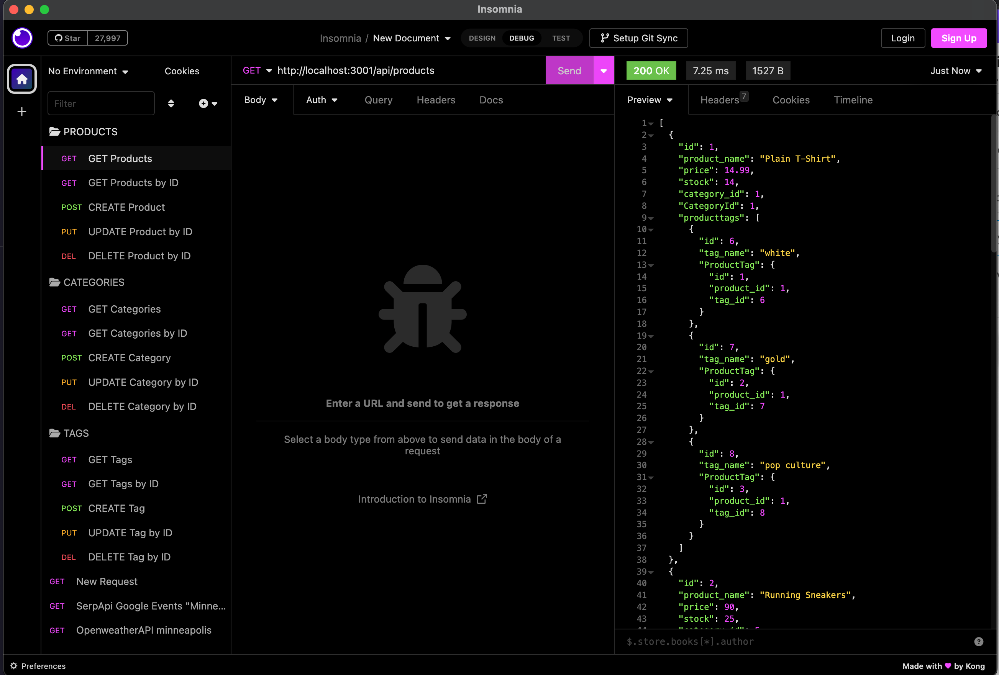

# ORM Based E-Commerce Backend Server

This is my express.JS API e-commerce site backend server and database. This project uses Object Relational Mapping. This is very helpful in making detailed queries to a SQL database. This was a great intro into the sequelize package as well. Learning how to do basic work with a e-commerce sites database will be good experience!

## Links:

* [Here's a link to the google drive video](https://drive.google.com/file/d/1DIhXVGGg0jT3isluibM4wgvUu2K1C8Wx/view)
